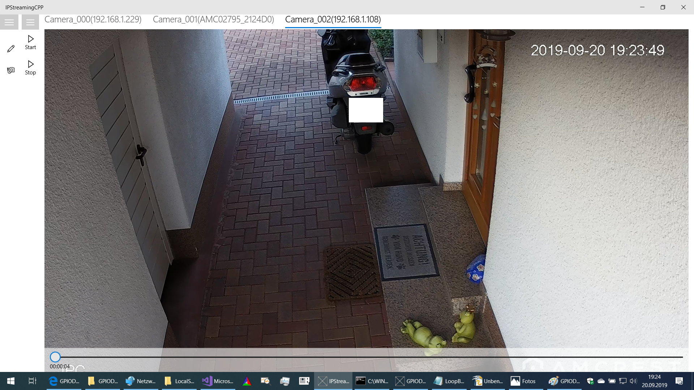

# IPStreaming (UWP-Project divided in two packages IPStreamingCPP and OnVifUniversal)
Extended FFmpegInterop in conjunction with OnVif capable IP cameras for recording / remuxing ffmpeg input streams

# Screenshot with 3 active cameras

Created with Visual Studio 2017

Usable for Raperry Pi: with streaming rate (640x480)@10fps, no audio, only 1 camera active (tested with  Pi 3 B and standard Touch Display 800x480), rtsp-input of IP camera (AMCREST 1080P) are remuxed to output file in local APP storage folder. Streaming settings are configured, that each hour a new file are created, older files than 72 hours are deleted automatically.

# Package IPStreamingCPP (C++ UWP)

FFmpeg straming based on FFmpegInterop : https://github.com/Microsoft/FFmpegInterop (my sincerely thank to the programmers, a wonderful project)
with extensions as follow:
- rtsp-IP-streaming with timeout behavior
- rtsp-IP-streaming parameter for minimal time lag between camera and screen, please using adjustment "Force Video"
- rtsp-IP-streaming: adjustment "Force Video" should be used, and Video or Audio can be switch on/off
- Muxing or remuxing ffmpeg input stream to output file:
  - recorded files are stored in local APP storage folder
  - in output format (.mp4, ...) with variable parameters (size, fps)
  - remuxing input to output file in .mp4 format, parameters comes from input stream
  - older recorded files can be deleted: after choosen time older files are deleted to prevent storage overrun
  - recorded input can be splitted in multiple files: each hour (adjustable) a new file is created
  - automatic restarting of input stream to prevent time lag between camera input and shown screen display. Experience had shown, that in case of more than 12 hour continuous streaming, a time lag between camera output and screen display can occurs. To prevent that a restart of streaming each 12 hour is meaningful.
  
- Muxing ffmpeg input stream to video format for using in connected browser clients:
  - mpegvideo format i sended to node.js listener which can streaming incoming steam over WebSocket to connected clients browser
  - start MJPEG server for supporting connected browser clients with streaming data in MJPEG format
  
 - using OnVifUniversal-Library as reference for reading out streaming url used as rtsp-ffmpeg input
 - using OnVifUniversal-Library for adding / editing OnVif IP-cameras
 
 - more than One OnVif-camera are supported, before you can use streaming you have to add Onvif Camera with (IP adress, User,     Password). User and Password for camera access are often (admin/admin). Please attend, camera can only used in local network.
 - all Streaming adjustements of each camera are store in local storage for reloading after new start

# Package OnVifUniversal (.Net UWP)
- Library with interface to IP cameras in local network, which are supports OnVif interface (e.g. AMCREST 1080P)
- reading out of camera profile (video or audio): streaming url is used for ffmpeg streaming input
- setting camera profile parameter: video.FrameRate, video.Resolution, video.Bitrate, audio.Bitrate, audio.SampleRate 
- PTZ controlling
- important camera adjustments are store in local storage for reproducing after progra restart

# Package OnVifDiscoveryApp (.Net Win32 Desktop -App)
- Console App for Discovery Onvif capable device in local network
- Datagram Server listen to a Socket (30000) for processing any request from Discovery-Client (e.g. IPStreamingCPP)
- After Client request founded OnVif Cients are returned  (information item like IP Adress, http-Web-Adress, DNS-Name) to requester. So returned information  can be further used for reading out streaming url of Onvif Devives or for PTZ controlling.
- direct accessing to local Onvif Devices in UWP-App was not possible. "System.ServiceModel.Discovery" is not available in UWP, therefore function was be outsourced in own win32 .Net App implementation. First, OnVifDiscoveryApp.exe must be started before any OnVif discovery request from IPStreamingCPP can be responsed.
 

Short progam explanation in FFmpegInteropExt.pdf (not actual).

Type errors are to apologize.
